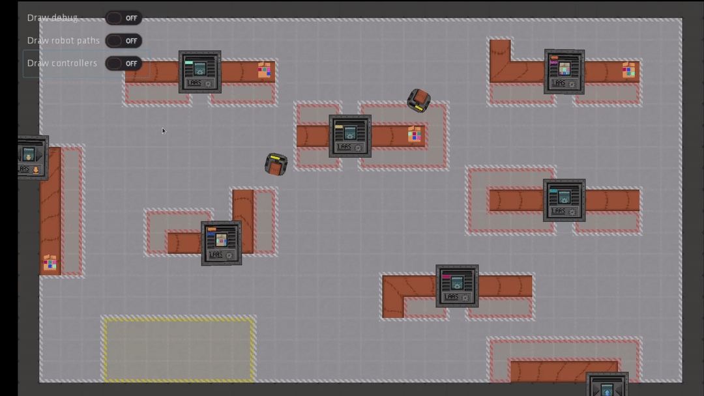

# *Gobot-Sim*: a godot-based high-level robotic simulator

This project is a robotics simulator made with Godot game engine, developed as LAAS-CNRS.

The scenarios modeled correspond to a general case of a factory, with packages needing to be processed by machines.  The role of robots is to move and carry packages to bring them to machines.

The simulator provides a high level of abstraction, allowing AI developers to abstract away the lower level aspects of robot control. For instance, the environment is modeled in 2D, the physics of robots (for example manipulation of objects) are also greatly simplified and high-level procedures are available to handle navigation in the environment.

For more information on different parts of the simulator, please see the files in the [documentation](doc) folder.

## Running the project

There are several possibilities :
- Directly run the project as is, using the Godot game engine
- Exporting the project as a package (unique file), and run this package using the Godot game engine
- Exporting the project as a binary

In all cases, the project can be run from command line  with arguments. For more details on the step of running the project, see [Running the simulation](doc/run_simulation.md) file. This contains more information about the command used to run the project, as well as the arguments that can be used.

## How to export

The first and easiest option to export is to directly open the project through the Godot editor, and use the exporting option (located in 'Project' options at the top of the editor). This opens the export menu where export templates can be directly downloaded, and the project can be exported as either a package or a binary file.

It is also possible to export directly from command line. For that, it is necessary to download both the Godot game engine (standard or headless versions can export), as well as the necessary export templates depending on the platform. Both download are available on the [official Downloads page](https://godotengine.org/download).

Then, run the Godot binary with the `--export` or `--export-debug` command line parameters, then the name of the export preset and the destination file. If the binary is being run from a location different than the project, the project location can be specified with `--path project_path`, where project_path is the path of the project folder (the folder containing the project.godot file, which corresponds to the simu folder in the repository).

The export preset argument must correspond to an existing preset that has been defined, with the corresponding template available. For more details on exporting projects, see the ['Exporting projects' page in Godot documentation](https://docs.godotengine.org/en/stable/getting_started/workflow/export/exporting_projects.html).

An example of command to export as a .pck package file is :

    $GODOT_PATH --export "Linux/X11" simulation.pck

This command is used in CI to export the project before running tests.

## Connecting an external program to the simulation

A program can connect to the simulation, and then both receive the description of the state of the simulation and send commands to the simulation. The communication is done with a server opened inside the simulation, by using TCP protocol with messages encoded in JSON format. For more information on the messages that are transmitted, see [Communication interface](doc/communication.md).

A client API has been developped in Python (clients/python_client folder). It is possible to create a controller in Python using this client. In that case, simply create an instance of `CompleteClient` class. A function is then available to connect to the server. Afterwards, several functions can be used to both read the state of the simulation and send commands (and then follow the state of commands in progress). For examples of use of this Python API, see the tests implemented in tests folder.
